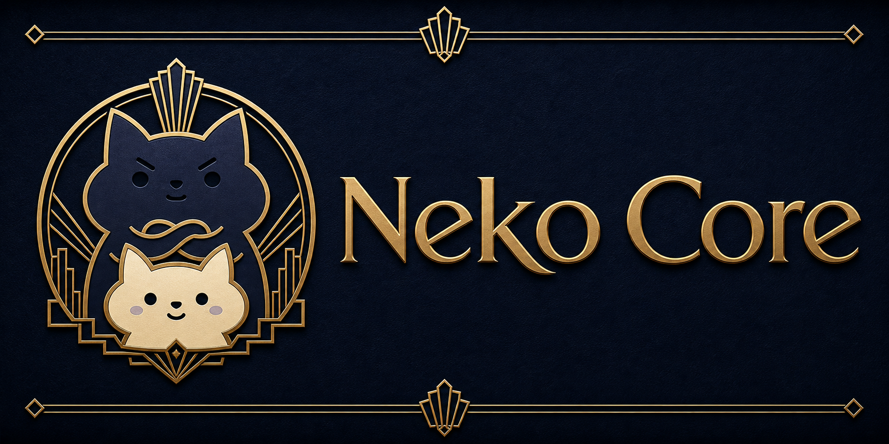

# Neko Core

[](https://github.com/meiiie/bang_c/actions/workflows/ci.yml)
[](https://github.com/meiiie/bang_c/actions/workflows/release.yml)



Status: competition harness

Neko Core is a config-first inference harness for HackAIthon 2026 Bang C. It
is intentionally separate from Wiii Core: the runtime container stays small,
reproducible, and limited to the contest contract, while development workflows
keep traces, review tasks, and model checks outside the submitted artifact.

## Reproduce the contest result (HackAIthon Bảng C judges read this)

The submission is a **self-contained, offline Docker image**. It reads
`/data/*_test.csv`, runs Gemma-4-26B-A4B (QAT Q4_0 GGUF, MoE) locally, and writes
`/output/pred.csv` (`qid,answer`). No API key, no network. Two commands:

```bash
# 1. Pull the pinned, self-contained image (the model is baked in)
docker pull hacamy12345/neko-core:gemma26b-q4-clean-20260614

# 2. Run on a folder containing public_test.csv or private_test.csv
docker run --rm --gpus all \
  -v /path/to/data:/data \
  -v /path/to/output:/output \
  hacamy12345/neko-core:gemma26b-q4-clean-20260614
# -> writes /path/to/output/pred.csv  (qid,answer; one option letter per row)
```

`gemma26b-q4-clean-20260614` is the v0.6.0 submission image: built fresh from this
commit (no public-test hard-codes in any layer), default workflow `self-consistency`,
public-463 leaderboard **88.34**.

The entrypoint runs `--workflow self-consistency --data-dir /data --output-dir
/output --auto-resume`; the pred.csv is contract-repaired (covers exactly the
input qids with valid letters) and written **before** any validation, so a single
bad question can never zero the run. To rebuild the image from source instead of
pulling, see [Docker](#docker). Method/idea write-up:
[`docs/method-writeup-vi.md`](docs/method-writeup-vi.md) (VI) and
[`docs/method-writeup.md`](docs/method-writeup.md) (EN).

## Install Neko Core (development tooling)

Windows PowerShell:

```powershell
irm https://neko.holilihu.online/install.ps1 | iex
neko --doctor
```

Linux/macOS:

```bash
curl -fsSL https://neko.holilihu.online/install.sh | bash
neko --doctor
```

The installer uses `pipx`, so the `neko` command is isolated from system Python
packages. It runs `pipx ensurepath`, updates the current shell `PATH` when the
pipx app directory is discoverable, and verifies `neko --version` before
finishing. If the command is not visible immediately, open a new terminal or
add the pipx app path shown by the installer to `PATH`.

`neko` is the primary command. `neko-core` and `bang-c` are compatibility
aliases, and `neko core --doctor` is accepted as a namespace-style alias.

For CI, scripts, or repeatable machine setup:

```powershell
$env:NEKO_NON_INTERACTIVE = "1"
$env:NEKO_INSTALL_SOURCE = "git+https://github.com/meiiie/bang_c.git"
irm https://neko.holilihu.online/install.ps1 | iex
```

```bash
export NEKO_NON_INTERACTIVE=1
export NEKO_INSTALL_SOURCE="git+https://github.com/meiiie/bang_c.git"
curl -fsSL https://neko.holilihu.online/install.sh | bash
```

Upgrade or uninstall:

```powershell
python -m pipx upgrade neko-core
python -m pipx uninstall neko-core
```

Fallback GitHub raw installer URLs:

```powershell
irm https://raw.githubusercontent.com/meiiie/bang_c/main/install.ps1 | iex
```

```bash
curl -fsSL https://raw.githubusercontent.com/meiiie/bang_c/main/install.sh | bash
```

See `docs/distribution-domain.md` for the Cloudflare routing plan.

## Contest Contract

- Input: `/data/public_test.csv` or `/data/private_test.csv`
- Output: `/output/pred.csv`
- Output columns: `qid,answer`
- Answer format: choice letters such as `A`, `B`, `C`, `D`; the loader also
  supports more choices for local public-test analysis.
- Allowed LLM family from the user's rule screenshot:
  - `Qwen3.5` series with model size <= 9B
  - `Gemma-4` series
- Allowed embedding/rerank family:
  - `BGE-M3`
  - `Qwen-Rerank`
- Chosen contest runtime: `Gemma 4 26B A4B QAT Q4_0 GGUF`, packaged into
  the local Docker image so BTC does not need an NVIDIA API key.

## Config-First Harness

Runtime behavior is configured through `configs/default.json`:

- input file candidates;
- output filename and columns;
- runtime profile selection;
- provider registry, local Gemma model path, and optional NVIDIA API model;
- retry/timeout policy;
- multilingual profiling markers;
- classifier thresholds;
- harness rubric weights.

Current runtime profiles:

- `gemma26b-q4-local`: default self-contained contest path.
- `nvidia-gemma31b-api`: explicit development/API path.

Inspect and select profiles without editing source:

```powershell
neko --profiles
neko --profile nvidia-gemma31b-api --doctor
$env:HACKC_PROFILE = "gemma26b-q4-local"
```

Use `--config path\to\config.json` for a different config file and
`--profile <name>` or `HACKC_PROFILE` for one named runtime profile inside that
config. The goal is to adapt to private-test variation without editing source
code.

## Runtime Provider Direction

The final contest direction is local-first:

- default provider: `local_llamacpp`;
- default local model: `google/gemma-4-26B-A4B-it-qat-q4_0-gguf:Q4_0`;
- expected GGUF file: `/models/gemma-4-26B_q4_0-it.gguf`;
- final Docker image should be self-contained and should not require
  `NVIDIA_API_KEY`.

NVIDIA remains an optional provider for development and future extension. Set
`--profile nvidia-gemma31b-api` plus `NVIDIA_API_KEY`, or set
`HACKC_PROVIDER=nvidia` explicitly, to use the OpenAI-compatible API path. The
local Wiii NVIDIA key can list models through
`https://integrate.api.nvidia.com/v1/models`. As of 2026-06-08, useful API
matches included:

- `google/gemma-4-31b-it`
- `baai/bge-m3`

`qwen-rerank` was not visible in the local `/models` response, so rerank remains
an adapter boundary until an available endpoint is confirmed.

## Run Locally

From this folder:

For global installation, use the `Install Neko Core` section above.

One-command local install:

```powershell
.\scripts\bootstrap.ps1
.\neko.ps1 --quickstart
.\neko.ps1 --doctor
.\neko.ps1 --capabilities
.\neko.ps1 --agents
.\neko.ps1 --tools
.\neko.ps1 --commands
.\neko.ps1 --policy
.\neko.ps1 --model-inventory
.\neko.ps1 --list-workflows
.\neko.ps1 --init
```

`bootstrap.ps1` creates `.venv`, installs the local editable package, and runs
fast checks for `--version`, `--doctor`, `--policy`, and `--list-workflows`.
Use `.\scripts\bootstrap.ps1 -SkipChecks` only when you need installation
without validation.

Or install manually:

```powershell
python -m pip install -r requirements.txt
$env:PYTHONPATH = "$PWD/src"
python -m hackaithon_c.run --workflow quick-dry-run --input "C:\Users\Admin\Downloads\public-test_1780368312.json" --output-dir output --limit 5
```

After bootstrap, use the local CLI shim:

```powershell
.\neko.ps1 --input "C:\Users\Admin\Downloads\public-test_1780368312.json" --output-dir output --limit 5
```

`.\neko-core.ps1` and `.\bang-c.ps1` remain compatibility aliases.

CLI fast paths inspired by Claude Code:

- `--version`: identity check without running inference.
- `--banner`: ASCII brand preview.
- `--doctor`: local environment and contest-contract diagnostics.
- `--init`: create `.neko-core/config.json` for project-local workflow/model
  tuning without editing source files.
- `--capabilities`: explicit runtime/development capability registry.
- `--agents`: named harness role registry for runner, classifier, solver,
  verifier, reviewer, resolver, session inspection, and model inventory.
- `--agent <name>`: inspect one role's tools, reads, writes, and handoff
  boundary, for example `--agent task-resolver`.
- `--tools`: tool contract registry with runtime/development phase, status,
  permission class, inputs, outputs, and guardrails.
- `--tool <name>`: inspect one tool contract, for example `--tool web-research`
  or `--tool exporter`.
- `--commands`: command registry with phase, category, example, and guardrail
  for each CLI or script surface.
- `--command <name>`: inspect one command, for example `--command run` or
  `--command trace-review`.
- `--profiles`: print named runtime profiles from the active config.
- `--profile <name>`: select one runtime profile for this invocation.
- `--policy`: audit runtime/development boundaries across registry surfaces.
  The solve path also enforces this gate before loading input or model state.
- `--model-inventory`: probe NVIDIA `/models` and filter models by Bang C
  allowed LLM and embedding/rerank families. Combine with `--run-dir` to save
  `model-inventory.txt` before model experiments.
- `--list-workflows`: named runtime/development workflow registry.
- `--check-submission <pred.csv>`: read-only validation for the final artifact.
  It checks the file name, exact `qid,answer` header, row count, duplicate or
  missing qids, and whether each answer belongs to that row's available choice
  letters. It intentionally derives allowed letters from the input instead of
  hard-coding A-D.
- `--yolo`: bounded autonomous run preset. It selects `contest-strict` when no
  workflow is provided, enables `--auto-resume`, keeps checkpointing on, writes
  run/session review artifacts, and still enforces the policy and output
  contract. It does not submit results, delete files, bypass model rules, or use
  web/subagents inside the final runtime.

Configured workflow examples:

```powershell
.\neko.ps1 --workflow quick-dry-run --input "C:\Users\Admin\Downloads\public-test_1780368312.json" --output-dir output --limit 5
.\neko.ps1 --workflow verify-all --input "C:\Users\Admin\Downloads\public-test_1780368312.json" --output-dir output --limit 5
.\neko.ps1 --workflow quick-dry-run --input "C:\Users\Admin\Downloads\public-test_1780368312.json" --run-dir run-smoke --limit 5
```

The Docker default uses `contest-strict` with checkpointing and auto-resume so
one container command can keep progressing through long public/private files.
Use the same path locally when accuracy is more important than API call count
or runtime:

```powershell
.\neko.ps1 --workflow contest-strict --input "C:\Users\Admin\Downloads\public-test_1780368312.json" --run-dir run-strict --auto-resume --checkpoint-every 1
```

For explicit NVIDIA development runs:

```powershell
$env:NVIDIA_API_KEY = "<set outside git>"
.\neko.ps1 --profile nvidia-gemma31b-api --workflow contest-strict --input "C:\Users\Admin\Downloads\public-test_1780368312.json" --run-dir run-nvidia
```

The shorter autonomous preset is:

```powershell
.\neko.ps1 core --yolo --input "C:\Users\Admin\Downloads\public-test_1780368312.json"
```

For a contest-style container command, keep `/output/pred.csv` explicit while
storing resume/review artifacts under `/output/neko-run`:

```bash
neko core --yolo --data-dir /data --output-dir /output --run-dir /output/neko-run
```

If uploading through the website manually, upload the generated file named
`pred.csv`; do not upload a renamed run artifact such as
`neko-core-bang-c-public-v5-reviewed.csv`.

Validate the upload artifact before submitting:

```powershell
.\neko.ps1 --input "C:\Users\Admin\Downloads\public-test_1780368312.json" --check-submission "C:\Users\Admin\Downloads\pred.csv"
```

`--run-dir` is a development session path. It writes `output/pred.csv`,
`traces/`, `run-report.md`, `review-tasks.md`, `review-tasks.json`, and
`events.jsonl` together so experiments can be reviewed without remembering
separate output and trace paths.

For large files, do not paste the whole dataset into an AI chat. Let the CLI
iterate qid-by-qid and keep a checkpoint:

```powershell
.\neko.ps1 --workflow contest-strict --input "C:\Users\Admin\Downloads\public-test_1780368312.json" --run-dir run-full --auto-resume --checkpoint-every 1
```

`--auto-resume` reuses qids already recorded in
`traces/predictions.checkpoint.jsonl` after checking the input/config/workflow
metadata, and clears stale checkpoints when the input/config no longer match.

## RunPod Development GPU

RunPod is a development accelerator for building and profiling the local Gemma
image; it is not a hidden dependency for BTC scoring.

Recommended current default: RTX A6000 48 GB community. Use A40 48 GB as the
fallback when A6000 is unavailable, and L40S/A100/H100 only when wall-clock
speed is worth the extra spend.

Read-only shortlist:

```powershell
$env:RUNPOD_API_KEY = "<set outside git>"
.\scripts\runpod-gpu-shortlist.ps1 -MinMemoryGB 48
```

See `docs/runpod-gpu-selection.md`.
The final `pred.csv` is still written only after the full prediction set passes
the contest contract validation.

Session inspection, inspired by Claude Code's `/resume` and `/session`
surfaces:

```powershell
.\neko.ps1 --list-runs --runs-root .
.\neko.ps1 --session run-smoke
.\neko.ps1 --events run-smoke
```

These commands only read local artifacts. They show workflow, model, contract
status, trace review status, review-task count, and the next review/resolve
commands for a run folder. `--events` renders the run timeline: session start,
per-qid prediction completion, trace writing, review, and session completion.

Verification report inspired by Claude Code's verification-agent pattern:

```powershell
.\scripts\verify.ps1 -InputPath "C:\Users\Admin\Downloads\public-test_1780368312.json"
.\scripts\verify.ps1 -InputPath "C:\Users\Admin\Downloads\public-test_1780368312.json" -Docker
```

The report prints command/output/result blocks and ends with `VERDICT: PASS`,
`VERDICT: FAIL`, or `VERDICT: PARTIAL`.

Workflow eval comparison:

```powershell
.\scripts\evaluate.ps1 -InputPath "C:\Users\Admin\Downloads\public-test_1780368312.json" -Limit 10
.\scripts\evaluate.ps1 -InputPath "C:\Users\Admin\Downloads\public-test_1780368312.json" -Workflows quick-dry-run,contest-auto -Limit 10 -Repeat 1
```

The eval script runs selected workflows as `--run-dir` sessions, compares
`pred.csv` stability, runs trace review, compares each run to the first run,
and writes per-run artifacts under `eval-runs/`, including `run-report.md`,
`review.txt`, and `compare-to-first.txt`. Each eval directory also includes
`eval-summary.json` and `eval-report.md` with a selected candidate for
machine-readable and human-readable run history.

Trace review:

```powershell
.\neko.ps1 --review-trace traces-verify
.\neko.ps1 --review-tasks traces-verify --run-dir run-review-tasks
.\scripts\resolve-tasks.ps1 -TaskPath run-review-tasks\review-tasks.json -InputPath "C:\Users\Admin\Downloads\public-test_1780368312.json" -Workflow verify-all
.\neko.ps1 --compare-traces traces-before traces-after
.\neko.ps1 --compare-traces traces-before traces-after --compare-qid test_0001
```

The reviewer is development-only. It reads `run-summary.json` plus
`predictions.trace.jsonl`, then reports low confidence, fallback paths, trace
warnings, missing roles, and blocked steps without touching `pred.csv`.
Trace comparison is also development-only; it compares manifest hashes,
prediction counts, changed answers, confidence drift, and fallback drift between
two runs.
Review tasks convert non-info findings into an action queue that another agent
or team member can work through without changing the contest artifact.
`scripts/resolve-tasks.ps1` reads that queue, reruns qid-scoped tasks with a
selected workflow, and writes `task-resolution-report.md`,
`task-resolution.json`, command output, and a scoped trace comparison when the
source run has a sibling `traces/` directory.

Dry-run smoke test without API:

```powershell
$env:PYTHONPATH = "$PWD/src"
.\neko.ps1 --input "C:\Users\Admin\Downloads\public-test_1780368312.json" --output-dir output --limit 5 --dry-run
```

Local Gemma 4 with a second verifier pass:

```powershell
python -m pip install -r requirements-local.txt
$env:HACKC_PROVIDER = "local_llamacpp"
$env:HACKC_LOCAL_MODEL_PATH = "C:\models\gemma-4-26B_q4_0-it.gguf"
.\neko.ps1 --input "C:\Users\Admin\Downloads\public-test_1780368312.json" --output-dir output --trace-dir traces --limit 5 --strategy verify
```

NVIDIA API experiment with a second verifier pass:

```powershell
$env:HACKC_PROVIDER = "nvidia"
$env:NVIDIA_API_KEY = "<set outside git>"
$env:HACKC_LLM_MODEL = "google/gemma-4-31b-it"
.\neko.ps1 --input "C:\Users\Admin\Downloads\public-test_1780368312.json" --output-dir output --trace-dir traces --limit 5 --strategy verify
```

Auto strategy with selective tournament:

```powershell
$env:HACKC_PROVIDER = "nvidia"
$env:HACKC_LLM_MODEL = "google/gemma-4-31b-it"
.\neko.ps1 --input "C:\Users\Admin\Downloads\public-test_1780368312.json" --output-dir output --trace-dir traces --limit 10 --strategy auto
```

Strategies:

- `direct`: one model call using the classifier-selected prompt variant.
- `verify`: direct call plus verifier call for every item.
- `tournament`: multiple prompt variants, majority vote, then optional verifier.
- `auto`: classifier decides when to verify or tournament. This is the default.

If a model returns explanation instead of a letter, the harness can run one
configured repair pass before falling back to heuristic overlap. This is
controlled by `runtime.repair_invalid_output` in `configs/default.json`.

Trace mode writes:

- `predictions.trace.jsonl`: raw model answer, normalized answer, strategy,
  question kind, confidence, fallback reason, and structured agent steps such
  as `classifier`, `solver`, `repair`, `verifier`, or `synthesizer`.
- `run-summary.json`: contract validation, strategy counts, question-kind
  counts, fallback count, average confidence, harness score.
- `run-manifest.json`: reproducibility metadata including config/input hashes,
  selected workflow, strategy, model, output path, trace path, and CLI args.

## Docker

Lightweight API/development image:

```powershell
docker build -t neko-core:dev .
```

Run the lightweight image only when explicitly using the NVIDIA provider:

```powershell
docker run --rm `
  -e HACKC_PROVIDER=nvidia `
  -e NVIDIA_API_KEY=$env:NVIDIA_API_KEY `
  -v C:\path\to\data:/data `
  -v C:\path\to\output:/output `
  neko-core:dev
```

Self-contained Gemma local contest image:

```powershell
.\scripts\build-gemma-image.ps1 -Image <dockerhub-user>/neko-core:gemma26b-q4
```

Pinned image currently available from Docker Hub:

```text
hacamy12345/neko-core:gemma26b-q4
hacamy12345/neko-core:gemma26b-q4-20260610
hacamy12345/neko-core@sha256:7034f3a4da3d00bc2de8d7d5ea56422cdeb5e74651a90beba220a962dc0f6760
```

If the Gemma repository requires authentication in your environment, set
`HF_TOKEN` outside git before building. The token is passed as a Docker BuildKit
secret and is not stored in the final image.

Run the self-contained image with a mounted data folder:

```powershell
docker run --rm `
  -v C:\path\to\data:/data `
  -v C:\path\to\output:/output `
  hacamy12345/neko-core:gemma26b-q4
```

The expected output is `C:\path\to\output\pred.csv`.

The official release workflow is designed to push a Docker Hub image when the
repository has `DOCKERHUB_USERNAME` and `DOCKERHUB_TOKEN` secrets configured.
The GitHub-hosted release workflow intentionally builds the lightweight image;
the Gemma image is large and should be built/pushed from a machine with enough
disk, RAM, and stable network. For a manual Gemma image release:

```powershell
.\scripts\build-gemma-image.ps1 -Image <dockerhub-user>/neko-core:gemma26b-q4
docker push <dockerhub-user>/neko-core:gemma26b-q4
```

For RunPod builders that cannot run Docker-in-Docker, use
`Dockerfile.gemma-local.kaniko`. The 2026-06-10 successful build used a large
RTX A6000 builder, Kaniko, and then validated the pushed digest on an A40 pod.
See `docs/runpod-operations.md` for the pinned digest, launch notes, and cleanup
rules.

## Release

GitHub Actions release workflow:

- verifies unit tests, source compilation, CLI policy, and Docker CSV contract;
- builds wheel and source distribution under `dist/`;
- attaches Python artifacts to GitHub Releases for tag builds;
- pushes `<dockerhub-user>/neko-core` to Docker Hub when secrets are present.

Required repository secrets for Docker Hub publishing:

- `DOCKERHUB_USERNAME`
- `DOCKERHUB_TOKEN`

Create a release tag:

```powershell
git tag v0.4.0
git push origin v0.4.0
```

Without Docker Hub secrets, the workflow still verifies and builds artifacts
but skips the Docker Hub push.

## Development Loop

Use web research, subagents, and multi-pass analysis only to improve the method
before packaging. The final runtime path must not depend on live web browsing,
external subagents, Wiii's full backend, or interactive UI state.

Recommended loop:

1. Run baseline on public test.
2. Inspect low-confidence traces.
3. Add one prompt or verifier change at a time.
4. Re-run the same sample and compare answer stability.
5. Keep only changes that improve reproducibility and rule compliance.

## Architecture Notes

The harness borrows product discipline from Wiii, Codex, Odysseus, and Goose:

- typed input/output contracts;
- provider/model state configured outside source code;
- small workflow modules instead of one prompt blob;
- explicit trace/eval artifacts for development;
- final container path kept independent of UI, browser, database, and web tools.

Detailed architecture and scoring notes:

- `docs/harness-architecture.md`
- `docs/evaluation-rubric.md`
- `docs/release-process.md`
