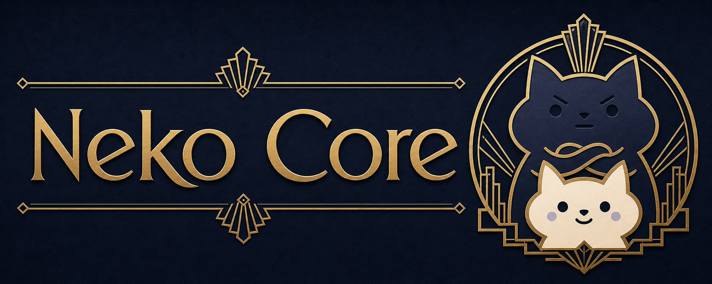

# Neko Core

[](https://github.com/meiiie/bang_c/actions/workflows/ci.yml)
[](https://github.com/meiiie/bang_c/actions/workflows/release.yml)



Trạng thái: bài dự thi **HackAIthon 2026 — Bảng C (Innovator)**

**Neko Core** là một harness suy luận *config-first*, đóng gói thành **một Docker image offline,
tự chứa**: đọc đề trắc nghiệm tại `/data`, chạy mô hình **Gemma-4-26B-A4B (QAT Q4_0 GGUF)** ngay
trong container, rồi ghi kết quả ra `/output/pred.csv`. Không cần API key, không cần mạng — đúng
"Yêu cầu đầu ra" của Bảng C.

## Đội thi — Neko Core

Trường **Đại học Hàng hải Việt Nam (VMU)**.

| Họ và tên | Lớp | Vai trò |
|---|---|---|
| Nguyễn Mạnh Hùng | CNT63ĐH | **Trưởng nhóm** (Team lead) |
| Bùi Việt Hoàng | CLC63ĐH | Thành viên |
| Phạm Thị Minh Hồng | CNT63ĐH | Thành viên |
| Phạm Thị Thu Thảo | KTN63ĐH | Thành viên |
| Nghiêm Thị Mỹ Linh | KPM63ĐH | Thành viên |

## Cách tái lập kết quả trong container (Ban Tổ chức đọc phần này)

Bài nộp là **một Docker image offline duy nhất, đã nướng sẵn mô hình bên trong**. Chỉ **2 lệnh**:

```bash
# 1) Kéo image (mô hình ~14GB đã nằm sẵn trong image; tổng ~23.5GB)
docker pull hacamy12345/neko-core:gemma26b-q4-clean-20260614

# 2) Chạy trên thư mục chứa public_test.csv hoặc private_test.csv
docker run --rm --gpus all \
  -v /duong/dan/data:/data \
  -v /duong/dan/output:/output \
  hacamy12345/neko-core:gemma26b-q4-clean-20260614
# => sinh ra /duong/dan/output/pred.csv  (hai cot: qid,answer)
```

Container tự động đọc `public_test.csv`/`private_test.csv` trong `/data`, chạy workflow mặc định
`self-consistency` (mô hình suy luận từng bước rồi trích ra chữ cái đáp án), và ghi `/output/pred.csv`.
File `pred.csv` được **ghi TRƯỚC khi kiểm tra hợp đồng** và tự sửa cho khớp đúng các `qid` đầu vào,
nên một câu lỗi không bao giờ làm hỏng (về 0) cả lần chạy. Toàn bộ chạy **offline** (không web,
không API key, không phụ thuộc dịch vụ ngoài).

> `gemma26b-q4-clean-20260614` là image bản **v0.6.0**, **dựng lại sạch từ chính commit này**
> (không có đáp án public-test gắn cứng trong bất kỳ layer nào). Điểm leaderboard public-463: **88.34**.

### Hợp đồng đầu vào / đầu ra

| Hạng mục | Giá trị |
|---|---|
| Đầu vào | `/data/public_test.csv` hoặc `/data/private_test.csv` |
| Đầu ra | `/output/pred.csv` |
| Cột | `qid,answer` |
| Giá trị `answer` | chữ cái phương án theo TỪNG dòng (A, B, C, D… tới J cho câu nhiều lựa chọn) |

### Mô hình & tuân thủ quy tắc Bảng C

- LLM: **Gemma-4 series** — cụ thể `Gemma-4-26B-A4B QAT Q4_0 GGUF`, chạy local qua llama.cpp
  (offline). Danh mục cho phép của Bảng C: Qwen3.5 ≤ 9B / Gemma-4; embedding-rerank: BGE-m3 / Qwen-Rerank.
- **Không gắn cứng đáp án public-test**; mọi đòn bẩy phải tổng quát hoá cho bộ private 2000 câu.

### Tài liệu thuyết minh phương pháp (chấm điểm Ý tưởng)

- [`docs/method-writeup-vi.md`](docs/method-writeup-vi.md) — **Tiếng Việt** (bản được chấm)
- [`docs/method-writeup.md`](docs/method-writeup.md) — English
- [`docs/Neko-Core-Thuyet-minh-phuong-phap.pptx`](docs/Neko-Core-Thuyet-minh-phuong-phap.pptx) — bản trình bày

---

## Developer reference (English)

Neko Core is a **config-first** harness: model/provider selection, thresholds, and rubric weights
live in `configs/default.json`, not in source. The submitted container is intentionally minimal and
offline; development tracing/eval lives outside the shipped artifact.

### Project structure

```text
src/hackaithon_c/      Harness: loader -> classifier -> prompting -> solver -> normalizer
                       -> contract validation -> pred.csv exporter (+ config, calibration, checkpoint)
configs/default.json   Config-first runtime: providers, model paths, profiles, thresholds, rubric
docker/                neko-entrypoint.sh (reads /data, writes /output/pred.csv)
Dockerfile.gemma-local.kaniko   The contest image build (Kaniko, self-contained Gemma Q4_0)
scripts/               Build + dev helpers
tests/                 Unit tests (run: python -m unittest discover -s tests)
docs/                  Method write-up, architecture, evaluation rubric
notes/                 Measured-result analysis (the leaders + the rejected levers, with numbers)
```

### Run locally (development)

```powershell
.\scripts\bootstrap.ps1          # create .venv, install editable package, fast checks
.\neko.ps1 --doctor              # environment + contract diagnostics
.\neko.ps1 --workflow self-consistency --input <public-test.json> --run-dir run --auto-resume
.\neko.ps1 --check-submission <pred.csv>   # validate name/header/qids/per-row letters
```

`--check-submission` derives the valid answer letters per row from the input (no hard-coded A–D).
NVIDIA is an optional **development-only** provider (`--profile nvidia-gemma31b-api` + `NVIDIA_API_KEY`);
the contest path stays `local_llamacpp` with the baked GGUF.

### Build the contest image

The self-contained Gemma image is large; build it on a machine with enough disk/RAM/network. For
RunPod builders without Docker-in-Docker, `Dockerfile.gemma-local.kaniko` builds it via Kaniko (the
`llama-cpp-python` runtime is source-built with `GGML_NATIVE=OFF` so the image runs on any CPU).
See [`docs/runpod-operations.md`](docs/runpod-operations.md) and [`docs/release-process.md`](docs/release-process.md).

### Architecture & docs

- [`docs/harness-architecture.md`](docs/harness-architecture.md) — layered pipeline + contracts
- [`docs/evaluation-rubric.md`](docs/evaluation-rubric.md) — scoring model
- [`docs/local-gemma-runtime.md`](docs/local-gemma-runtime.md) — local Gemma runtime
- [`docs/submission-readiness.md`](docs/submission-readiness.md) — submission checklist
